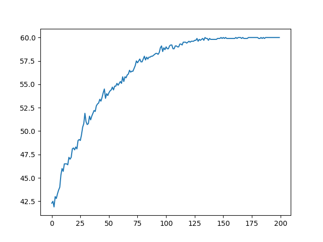
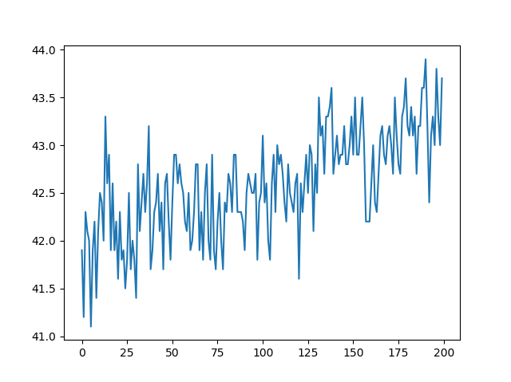
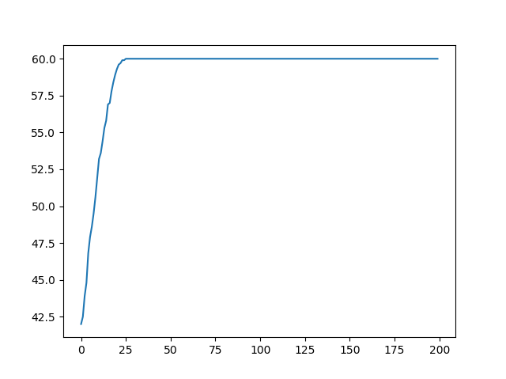
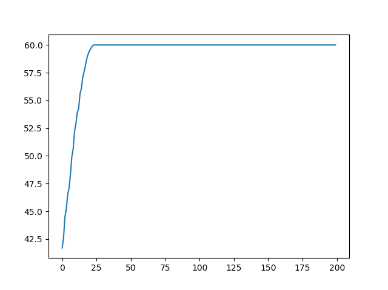

# Evolutionary Computation HW1

0856054 莊紹平

## Q1
(a). C(64,8)
(b). 8-digit strings, each digit is positive integer and is in [1,8] which indicates the the position that the queen should be in each row of chessboard repectivly.
\(c\). 8!
(d). Due to the rules that the queen can move vertically and horizontally, So:
 - Any pair of queens must not be in the same row.
 - Any pair of queens must not have the same position in thier own rows.

Using this genotype representation is able to cover the phenotype space where has answer.

## Q2
2^-1 = 0.5
2^-2 = 0.25
2^-3 = 0.125
...
2^-9 = 0.001953125
2^-10 = 0.0009765625 (<0.001)

ans: 10 bits

## Q3
```$ python HW1.py -s r -f 0 -r 10```


## Q4
```$ python HW1.py -s r -f 800 -r 10```


## Q5
From Q3, we can see that the Roulette wheel selection can improve the fitness in a acceptable speed.
We can see that it is hard to increase the fitness under the 800 fitness bias condition from Q4 result. But it still improve the fitness slowly even the path is extremely unstable.
The 800 bias is large enough to make the Roulette wheel selection hard to select the higher fitness individual.

## Q6
```$ python HW1.py -s t -f 0 -r 10```


## Q7
```$ python HW1.py -s t -f 800 -r 10```


## Q8
It seems that there is nearly no difference between Q6 result and Q7 result. Both of them are improve the fitness very fast and has good stability.

## Q9
From Q3 and Q6, we can see that the Tournament selection raise the fitness faster than the Roulette wheel selection and have slightly better stability.
From Q4 and Q7, we can see that the Roulette wheel selection can not afford the large bias due to the probability-based method, while Tournament selection seems immune the bias due to the pair-wise comparison.